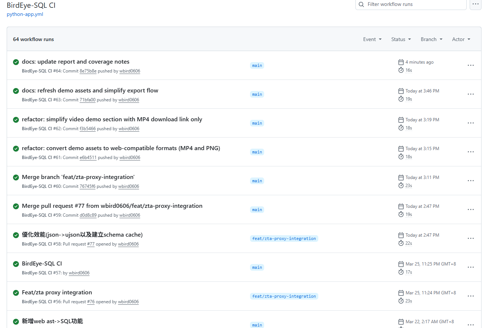

# 第 7 週專題期末進度報告

學號：513558006

專題名稱：BirdEye-SQL（MSSQL 雙向 SQL <-> AST 引擎）

## 1. GitHub 活動紀錄
URL:https://github.com/wbird0606/BirdEye-SQL.git
### 1.1 貢獻摘要
- 專案總提交數（主分支歷史）：78
- 作者提交統計：
  - wbird0606：74 次提交
  - wbird：4 次提交

### 1.2 本週重點提交（第 7 週相關）
- 71bfa00（2026-04-03）：更新文件與 demo 匯出流程
- f3b5466（2026-04-03）：精簡影片展示段落
- e6b4511（2026-04-03）：將 demo 資產轉為網頁相容格式
- e515a77（2026-04-03）：效能優化（json -> ujson 與 schema cache）
- 3ff06ea（2026-03-24）：多 Schema 支援、新語法節點與覆蓋率補齊
- ba27656（2026-03-24）：新增 final coverage 測試，覆蓋率由 97% 提升至 99%
- 50b9abe（2026-03-23）：COUNT(*) / SELECT * 展開為逐欄 READ intent
- 54da04e（2026-03-23）：修正 IntentExtractor 邊界案例（#67-#73）
- 7efbc9c（2026-03-22）：新增 Web AST -> SQL 功能
- 總提交

### 1.3 期間活動快照（程式碼變更面向）
- 核心模組大幅更新：
  - Parser、Binder、Registry、Reconstructor、Serializer、Visualizer
- 測試規模與穩定性提升：
  - 新增或更新 intent、parser coverage、reconstructor coverage、final coverage 測試
- 文件與 Web 介面持續優化：
  - README 更新與前端/API 內容調整

## 2. 目前已完成功能

### 2.1 核心引擎與流程
- 完成 SQL 全流程處理：
  - Lexer -> Parser -> Binder -> Visualizer/Serializer -> Reconstructor
- 完成雙向轉換：
  - SQL -> AST JSON
  - AST JSON -> SQL

### 2.2 MSSQL 語法支援
- 已實作並穩定化的語法包含：
  - TOP / TOP PERCENT
  - OFFSET / FETCH
  - WITH CTE（含 CTE + UPDATE/DELETE）
  - DECLARE、GO 批次處理、暫存資料表（# / ##）
  - CROSS APPLY / OUTER APPLY
  - 集合運算：UNION、INTERSECT、EXCEPT
  - 衍生資料表與巢狀子查詢

### 2.3 語意分析與安全（ZTA）
- 已實作嚴格零信任語意驗證：
  - 型別推論與相容性檢查
  - Alias 政策強制
  - 多表情境欄位歧義防禦
  - 函數白名單（sandbox）限制
  - 函數限制名單與危險函數封鎖
  - 危險預存程序黑名單（例如 XP_CMDSHELL、SP_EXECUTESQL 等）
- 新增欄位層級 intent 擷取：與 ZTA / 權限映射模組整合，需搭配相關上下文才能完整使用
  - READ / WRITE / DELETE 權限意圖映射

### 2.4 工具與介面
- CLI 支援雙向流程（SQL -> AST 與 AST -> SQL）
- Flask Web API 端點：
  - /api/parse
  - /api/reconstruct
  - /api/upload_csv
  - /api/intent：與 ZTA / 權限映射模組整合，需搭配相關上下文才能完整使用
- Web Dashboard 可進行互動式解析與重建

## 3. 已解決問題

### 3.1 語法解析與邊界修正
- 修正一元負號與負數字面值邊界案例
- 修正 CAST/CONVERT 在長度與 style 的解析行為
- 修正 keyword-as-alias 邊界情況
- 改善函數名稱與關鍵字重疊時的解析處理
- 修正 DISTINCT 與 NULL 字面值的語法解析
- 修正 TOP PERCENT 與 OFFSET/FETCH 分頁語法
- 修正 INSERT INTO...SELECT 與多列 VALUES 解析
- 修正 NOT IN / NOT EXISTS / CROSS JOIN / FULL OUTER JOIN 語法
- 修正 DECLARE、SELECT INTO、APPLY、MERGE、IF/ELSE 等新語法節點
- 修正 UNION / INTERSECT / EXCEPT 作為衍生資料表時的解析行為
- 修正巢狀衍生資料表與 JOIN 子查詢的 alias 要求
- 修正 BULK INSERT 與 GO 批次語法在腳本層的處理
- 修正 TRY_CAST / TRY_CONVERT 與多種字串函數的語法支援

### 3.2 語意與推論修正
- 修正純量/關聯子查詢 inferred_type 傳遞問題
- 改善外部連接（outer join）nullable 行為
- 修正集合運算衍生資料表的欄位名稱保留問題
- 修正 COUNT(DISTINCT) 與比較/集合運算的型別檢查
- 修正 JOIN、子查詢與衍生資料表的 scope / nullable 傳遞
- 修正暫存資料表（# / ##）與 GO 批次處理的狀態保留
- 修正日期部分識別符（YEAR / MONTH / DAY 等）與函數名稱衝突
- 修正 COUNT(*) / SELECT * 展開為逐欄 READ intent 的判定邏輯
- 修正 APPLY / 視窗函數 / set-op 邊界在 binder 中的解析與轉譯
- 修正函數白名單與內建函數註冊表的回傳型別/參數型別對應
- 修正 resolved_table 顯示與欄位來源追蹤的可視化資訊

### 3.3 效能與可維護性
- 導入 schema cache
- 優化 JSON 處理路徑（ujson）
- 重新整併測試套件結構並維持零回歸
- 整併並擴充覆蓋率導向測試套件
- 同步更新 Visualizer / Serializer 對 DECLARE、SELECT INTO、APPLY 等節點支援
- 新增與整併 intent、parser coverage、reconstructor coverage、final coverage 測試
- 壓縮並重整測試套件數量，維持功能覆蓋與執行穩定性

### 3.4 介面與整合修正
- 完成 Web AST -> SQL 重建流程
- 強化多 Schema 元數據支援與載入流程
- 修正 IntentExtractor 邊界案例與欄位層級 intent 擷取

## 4. 驗證與品質現況
- 目前測試結果：864/864 全數通過
- 目前行覆蓋率：100%
- TDD 原則：既有測試規格不變動，僅透過產品程式修正達成通過與覆蓋率目標
- 迴歸策略：每項功能搭配對應測試與整合測試，降低回歸風險
- 已建立CI，每次push皆會經過測試驗證

## 5. 後續規劃（期末展示前）
- 持續補強深層巢狀 MSSQL 語句壓力測試
- 強化 API 錯誤訊息與邊界防護
- 優化最終展示流程與範例敘事

## 6. 結論
截至第 7 週，專案已達成高穩定、高覆蓋率里程碑，具備完整 SQL <-> AST 雙向能力、嚴格語意/ZTA 防護，以及可用的 CLI/Web 操作介面。本週重點成果為效能優化、覆蓋率強化以及展示文件整理。
