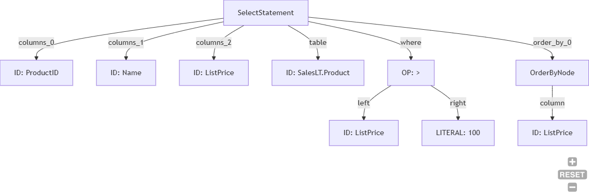

# 🦅 BirdEye-SQL: Semantic-Aware & Zero-Trust SQL Parser

[](https://docs.pytest.org/)
[]()
[](https://opensource.org/licenses/MIT)

🌍 **Language Switch / 語言切換**: [English](#english-version) | [繁體中文](#繁體中文版本)

---

<a id="english-version"></a>
# 🇬🇧 English Version

## 📖 Overview
**BirdEye-SQL** is a high-performance **bidirectional SQL ↔ AST** (Abstract Syntax Tree) engine specifically designed for **MSSQL** environments. Unlike traditional syntactic parsers, BirdEye-SQL features **Semantic Awareness**, allowing it to validate queries against real database metadata in a **Zero Trust Architecture (ZTA)** context. It acts as a security gatekeeper, intercepting malicious or ambiguous queries before they reach the database engine. The engine also supports the **reverse direction**: reconstructing valid SQL from an AST JSON, enabling round-trip transformations and query rewriting workflows.

## 🚀 Getting Started

### Environment Setup
Ensure you have Python 3.10+ installed, then run:
```powershell
python -m venv .venv
.\.venv\Scripts\activate
pip install -r requirements.txt
```

### Quick Usage (3 Minutes)
If this is your first run, follow this order:

```powershell
# 1) SQL -> AST (tree/json/mermaid all at once)
python main.py --sql "SELECT TOP 5 Name FROM SalesLT.Product" --format all

# 2) SQL file + your schema metadata CSV
python main.py --file query.sql --csv schema.csv --format tree

# 3) AST JSON -> SQL
python main.py --ast-file ast.json

# 4) Generate valid ast.json from parser output (recommended flow)
python main.py --sql "SELECT TOP 5 Name FROM SalesLT.Product" --format json > ast.json
python main.py --ast-file ast.json
```

Important:
- `SELECT_STATEMENT ...` tree text is NOT JSON.
- `--ast` / `--ast-file` only accepts serializer JSON output.

Expected outcome:
- `--format tree`: readable semantic tree
- `--format mermaid`: flowchart text for Mermaid rendering
- `--format json`: serialized AST JSON

### SQL Demo Samples
Use these when you want to demo different parser / binder / serializer paths:

```sql
-- 1) Basic SELECT
SELECT AddressID, City, PostalCode
FROM SalesLT.Address;

-- 2) TOP + ORDER BY
SELECT TOP 5 ProductID, Name, ListPrice
FROM SalesLT.Product
ORDER BY ListPrice DESC;

-- 3) JOIN
SELECT c.CustomerID, c.FirstName, c.LastName, a.City
FROM SalesLT.Customer AS c
JOIN SalesLT.CustomerAddress AS ca ON c.CustomerID = ca.CustomerID
JOIN SalesLT.Address AS a ON ca.AddressID = a.AddressID;

-- 4) GROUP BY + HAVING
SELECT CustomerID, COUNT(*) AS OrderCount
FROM SalesLT.SalesOrderHeader
GROUP BY CustomerID
HAVING COUNT(*) > 1;

-- 5) Window function
SELECT SalesOrderID, CustomerID,
       ROW_NUMBER() OVER (PARTITION BY CustomerID ORDER BY OrderDate) AS rn
FROM SalesLT.SalesOrderHeader;

-- 6) Subquery
SELECT ProductID, Name
FROM SalesLT.Product
WHERE ProductID IN (
    SELECT ProductID
    FROM SalesLT.SalesOrderDetail
);
```

Sample files you can create directly:

`query.sql`
```sql
SELECT TOP 5 ProductID, Name, ListPrice
FROM SalesLT.Product
WHERE ListPrice > 100
ORDER BY ListPrice DESC;
```

`ast.json`
```json
{
    "node_type": "SelectStatement",
    "select_list": [
        {
            "node_type": "ColumnNode",
            "column_name": "Name"
        }
    ],
    "from_clause": {
        "node_type": "TableNode",
        "table_name": "SalesLT.Product",
        "alias": null
    }
}
```

### Web UI Dashboard
BirdEye-SQL features a modern, Flask-based Web UI that supports dynamic CSV metadata loading, real-time type inference, and interactive Mermaid flowchart rendering (with Pan/Zoom and SVG download).
```powershell
python web/app.py
```
Open your browser and navigate to `http://127.0.0.1:5000`!

**REST API Endpoints:**
| Method | Endpoint | Description |
|---|---|---|
| `POST` | `/api/parse` | SQL → AST: parse SQL and return `tree`, `mermaid`, `json` |
| `POST` | `/api/reconstruct` | AST → SQL: accepts `{"ast": <dict or JSON string>}`, returns reconstructed SQL |
| `POST` | `/api/upload_csv` | Upload a CSV metadata file to update the schema context |
| `POST` | `/api/intent` | SQL → column-level intent list (`READ`/`WRITE`/`DELETE`) for ZTA permission evaluation |

**`/api/parse` params notes:**
- `params` is optional.
- You can pass direct values (type inferred automatically):

```json
{
    "sql": "SELECT @city AS c, @age AS a, @ok AS o",
    "params": {
        "@city": "Taipei",
        "@age": 30,
        "@ok": true
    }
}
```

- You can also pass explicit type/value objects when needed:

```json
{
    "params": {
        "@city": {"type": "NVARCHAR", "value": "Taipei"}
    }
}
```

- Structural placeholders such as `FROM @table_name` and `ORDER BY @col_name` are fail-closed and only accept safe identifier values.

### Schema Metadata Export

BirdEye-SQL uses a CSV file to describe your database schema. For new exports, you should include schema and use the 4-column format. The 3-column format is kept for backward compatibility.

**4-column (recommended, with schema):**
```
table_schema,table_name,column_name,data_type
SalesLT,Customer,CustomerID,int
SalesLT,Customer,CompanyName,nvarchar
```

**3-column (no schema prefix):**
```
table_name,column_name,data_type
Customer,CustomerID,int
Customer,CompanyName,nvarchar
```

Run the following query in **SQL Server Management Studio (SSMS)** and export the result as CSV:

```sql
-- 4-column export (recommended)
SELECT
    s.name  AS table_schema,
    t.name  AS table_name,
    c.name  AS column_name,
    tp.name AS data_type
FROM sys.tables t
JOIN sys.schemas  s  ON t.schema_id    = s.schema_id
JOIN sys.columns  c  ON t.object_id    = c.object_id
JOIN sys.types    tp ON c.user_type_id = tp.user_type_id
WHERE t.is_ms_shipped = 0
ORDER BY table_schema, table_name, c.column_id;
```

Save the output as `schema.csv`, then load it into BirdEye via:
- **Web UI**: click the **Upload CSV** button on the dashboard
- **CLI**: pass `--csv schema.csv` to `main.py`
- **API**: `POST /api/upload_csv` with the file as multipart form data

### CLI Utility
You can also use the parser directly from the terminal:
```powershell
# SQL → AST: parse SQL and output an AST tree
python main.py --sql "SELECT * FROM Address" --format tree

# SQL → AST: parse from a file, use custom metadata, and output Mermaid syntax
python main.py --file my_query.sql --csv custom_schema.csv --format mermaid

# AST → SQL: reconstruct SQL from an AST JSON string
python main.py --ast '{"node_type": "SelectStatement", ...}'

# AST → SQL: reconstruct SQL from an AST JSON file
python main.py --ast-file my_ast.json
```

## ✨ Key Features

### 🛡️ ZTA Security Enforcement
* **Strict Type Inference**: A robust type inference engine supporting implicit casting (e.g., `DATETIME` vs `NVARCHAR`) and User-Defined Types (UDT). It blocks illegal operations like comparing incompatible types.
* **Strict Alias Policy**: Once a table alias is defined, the original table name is invalidated to prevent semantic shadowing attacks.
* **Ambiguity Defense**: Mandatory qualifiers in JOIN environments to prevent "Column Ambiguity Attacks".
* **Function Sandbox**: Implements a "Deny-by-Default" whitelist for database functions. Prevents execution of dangerous system functions like `xp_cmdshell`.

### ⚙️ Engine Capabilities
* **Full Pipeline Integration**: The `BirdEyeRunner` seamlessly connects the Lexer, Parser, Binder, and Visualizer. The `ASTReconstructor` provides the reverse direction: AST JSON → SQL.
* **Bidirectional Transformation**: Round-trip SQL → AST JSON → SQL is fully supported, enabling query rewriting, AST manipulation, and programmatic SQL generation.
* **Comprehensive Expression Engine**: Arithmetic (`+`, `-`, `*`, `/`, `%`), bitwise (`&`, `|`, `^`, `~`), logical (`AND`, `OR`, `IS NULL`, `BETWEEN`), comparison (`IN`, `NOT IN`, `EXISTS`, `NOT EXISTS`, `LIKE`), and nested `CASE WHEN` logic.
* **Star Expansion**: Automatically expands `SELECT *` or `Table.*` into explicit column lists using metadata.
* **MSSQL-Specific Syntax**: `TOP N [PERCENT]`, `OFFSET/FETCH`, `DECLARE @var`, `SELECT INTO #temp`, `CROSS/OUTER APPLY`, `WITH (CTE)`.

### 📐 Supported SQL Features

| Category | Features |
|---|---|
| **SELECT** | DISTINCT, TOP N / TOP N PERCENT, OFFSET/FETCH, INTO #temp |
| **JOIN** | INNER, LEFT, RIGHT, FULL OUTER, CROSS JOIN, JOIN subquery |
| **APPLY** | CROSS APPLY, OUTER APPLY |
| **Set Ops** | UNION, UNION ALL, INTERSECT, EXCEPT |
| **Subqueries** | Scalar, correlated, derived tables, ANY/ALL |
| **DML** | INSERT (single/multi-row/SELECT), UPDATE, DELETE, TRUNCATE, MERGE (INSERT/UPDATE/DELETE clauses) |
| **DDL** | CREATE TABLE, DROP TABLE [IF EXISTS], ALTER TABLE (ADD/DROP/ALTER COLUMN) |
| **Procedural** | IF/ELSE, EXEC (stored procedure), PRINT, multi-statement scripts (ScriptNode) |
| **CTE** | Single, multiple, WITH + DML (UPDATE/DELETE) |
| **Expressions** | CASE WHEN, BETWEEN, CAST(x AS TYPE(len)), CONVERT(TYPE, x, style) |
| **Operators** | Arithmetic, bitwise, modulo, comparison, LIKE, IN/NOT IN |
| **Functions** | 60+ built-in: aggregates, string, numeric, date, NULL-handling |
| **MSSQL** | DECLARE @var, SET @var, #temp / ##global temp tables, GO, BULK INSERT |

## 🖼️ Demo Preview

### Static Preview



This static preview shows the AST transformation workflow with full type inference.

### Animated Preview


This animated preview is useful when you want to watch the parsing and reconstruction flow step by step.

**What it demonstrates:**
- SQL → AST conversion with type annotations
- Interactive tree visualization
- AST → SQL reconstruction (round-trip)
- Zero Trust Architecture (ZTA) security enforcement

## 🧪 Testing Strategy (998 Tests Across 39 Suite Files)

Unified governance document: [UNIFIED_TEST_STRATEGY.md](UNIFIED_TEST_STRATEGY.md)

We strictly adhere to **Test-Driven Development (TDD)**. Every feature follows a **Red → Green → Zero Regression** cycle. The project currently contains **998 comprehensive test cases** across **39 test suite files** with **100% line coverage**. Representative core suites are listed below:

| Test Suite | Tests | Coverage |
|---|---|---|
| `test_lexer_suite.py` | 16 | Tokenization, keywords, comments, bracket escaping, N'' prefix |
| `test_parser_suite.py` | 23 | Statement routing, AST construction, syntax error boundaries |
| `test_expressions_suite.py` | 31 | Arithmetic/bitwise/modulo, CASE WHEN, BETWEEN, CAST/CONVERT with length/style |
| `test_functions_suite.py` | 27 | 60+ built-in functions, function sandbox, aggregate integrity, COUNT(DISTINCT) |
| `test_select_features_suite.py` | 41 | DISTINCT, TOP/PERCENT, ORDER BY, GROUP BY/HAVING, OFFSET/FETCH, NULL literals |
| `test_dml_suite.py` | 39 | INSERT (single/multi-row/SELECT), UPDATE, DELETE, TRUNCATE, mandatory WHERE |
| `test_join_suite.py` | 33 | INNER/LEFT/RIGHT/FULL/CROSS JOIN, nullable propagation, multi-table chains |
| `test_subquery_suite.py` | 32 | Scalar, correlated, derived tables, UNION/INTERSECT/EXCEPT derived, ANY/ALL |
| `test_cte_suite.py` | 10 | Single/multiple CTEs, CTE + UPDATE/DELETE, CTE scope isolation |
| `test_semantic_suite.py` | 23 | ZTA enforcement, type safety, alias policy, scope stack, ambiguity detection |
| `test_mssql_features_suite.py` | 49 | DECLARE, #temp tables, CROSS/OUTER APPLY, advanced types (Geography, XML…) |
| `test_mssql_boundary_suite.py` | 42 | Edge cases: negative literals, global ##temp, operators, INTERSECT/EXCEPT, string functions |
| `test_integration_suite.py` | 23 | End-to-end pipeline with real AdventureWorks metadata, cross-feature integration |
| `test_window_functions_suite.py` | 35 | Window function parsing, binder validation, and full-pipeline coverage |
| `test_metadata_roundtrip_suite.py` | 35 | Metadata-driven SQL → JSON → SQL roundtrip coverage |
| `test_visualizer_suite.py` | 39 | Tree rendering, Mermaid output, type annotation, all statement types |
| `test_serializer_suite.py` | 29 | JSON serialization of all AST node types, round-trip accuracy |
| `test_cli_suite.py` | 4 | CLI argument parsing, file I/O, output format validation |
| `test_web_api_suite.py` | 3 | RESTful endpoints, JSON response format, HTTP error codes |
| `test_mermaid_suite.py` | 3 | Mermaid flowchart generation and node structure |
| `test_reconstructor_suite.py` | 32 | AST JSON → SQL reconstruction, round-trip accuracy, all statement types |
| `test_final_coverage_suite.py` | 54 | Targeted coverage for binder, parser, lexer, reconstructor, visualizer edge cases |
| `test_intent_api.py` | 3 | Flask test client: `/api/intent` success, intent list, missing-sql 400 |
| `test_intent_zta_flow.py` | 2 | Intent extraction + ZTA permission check flow (ZTA parts skip if proxy unreachable) |
| `test_denied_intent.py` | 2 | Denied columns (EmailAddress, Phone) rejected by ZTA IBAC |
| `test_security_adversarial_suite.py` | — | SQL injection adversarial suite: boolean-blind, stacked queries, comment injection, UNION, linked server |
| `test_adversarial_appendix.py` | — | Supplementary adversarial edge cases |

**Current Status**: ✅ **100% Tests Passed** (998/998) — **100% Line Coverage**
```powershell
pytest tests/
```

**Coverage Command**
```powershell
python -m pytest --cov=birdeye --cov-report=term-missing tests
```

<br>
<hr>
<br>

<a id="繁體中文版本"></a>
# 🇹🇼 繁體中文版本

## 📖 專案概述
**BirdEye-SQL** 是一款專為 **MSSQL** 環境設計的高效能 **雙向 SQL ↔ AST**（抽象語法樹）引擎。不同於傳統的語法解析器，BirdEye-SQL 具備**語意覺知**功能，使其能在**零信任架構 (ZTA)** 背景下，根據真實的資料庫元數據驗證查詢語句。它作為資安守門員，在查詢進入資料庫引擎前，先行攔截具備惡意特徵或語意模糊的語句。引擎同時支援**反向轉換**：由 AST JSON 重建有效的 SQL 字串，實現往返轉換與查詢改寫工作流程。

## 🚀 快速開始

### 環境建置
請確保你已安裝 Python 3.10+，然後執行以下指令安裝必要套件：
```powershell
python -m venv .venv
.\.venv\Scripts\activate
pip install -r requirements.txt
```

### 快速上手（3 分鐘）
第一次使用時，建議按以下順序直接跑：

```powershell
# 1) SQL -> AST（一次輸出 tree/json/mermaid）
python main.py --sql "SELECT TOP 5 Name FROM SalesLT.Product" --format all

# 2) SQL 檔案 + 你的 schema metadata CSV
python main.py --file query.sql --csv schema.csv --format tree

# 3) AST JSON -> SQL
python main.py --ast-file ast.json

# 4) 先產生有效 ast.json，再進行 AST -> SQL（建議流程）
python main.py --sql "SELECT TOP 5 Name FROM SalesLT.Product" --format json > ast.json
python main.py --ast-file ast.json
```

重要：
- `SELECT_STATEMENT ...` 這種樹狀文字不是 JSON。
- `--ast` / `--ast-file` 只能接受 serializer 產生的 JSON。

預期結果：
- `--format tree`：可讀的語意樹
- `--format mermaid`：可直接貼到 Mermaid 的流程圖文字
- `--format json`：序列化 AST JSON

### SQL Demo 範例
如果你要做簡報或 demo，可以直接用下面幾組 SQL：

```sql
-- 1) 基本查詢
SELECT AddressID, City, PostalCode
FROM SalesLT.Address;

-- 2) TOP + ORDER BY
SELECT TOP 5 ProductID, Name, ListPrice
FROM SalesLT.Product
ORDER BY ListPrice DESC;

-- 3) JOIN
SELECT c.CustomerID, c.FirstName, c.LastName, a.City
FROM SalesLT.Customer AS c
JOIN SalesLT.CustomerAddress AS ca ON c.CustomerID = ca.CustomerID
JOIN SalesLT.Address AS a ON ca.AddressID = a.AddressID;

-- 4) GROUP BY + HAVING
SELECT CustomerID, COUNT(*) AS OrderCount
FROM SalesLT.SalesOrderHeader
GROUP BY CustomerID
HAVING COUNT(*) > 1;

-- 5) Window Function
SELECT SalesOrderID, CustomerID,
       ROW_NUMBER() OVER (PARTITION BY CustomerID ORDER BY OrderDate) AS rn
FROM SalesLT.SalesOrderHeader;

-- 6) 子查詢
SELECT ProductID, Name
FROM SalesLT.Product
WHERE ProductID IN (
    SELECT ProductID
    FROM SalesLT.SalesOrderDetail
);
```

可直接建立的範例檔：

`query.sql`
```sql
SELECT TOP 5 ProductID, Name, ListPrice
FROM SalesLT.Product
WHERE ListPrice > 100
ORDER BY ListPrice DESC;
```

`ast.json`
```json
{
    "node_type": "SelectStatement",
    "select_list": [
        {
            "node_type": "ColumnNode",
            "column_name": "Name"
        }
    ],
    "from_clause": {
        "node_type": "TableNode",
        "table_name": "SalesLT.Product",
        "alias": null
    }
}
```

### Web 視覺化儀表板
BirdEye-SQL 內建了一個基於 Flask 的現代化 Web UI，支援動態載入 CSV 元數據，並能即時渲染帶有型別推導的 AST Tree 與 Mermaid 流程圖（支援平移縮放與圖片下載）。
```powershell
python web/app.py
```
打開瀏覽器前往 `http://127.0.0.1:5000` 即可體驗！

**REST API 端點：**
| 方法 | 端點 | 說明 |
|---|---|---|
| `POST` | `/api/parse` | SQL → AST：解析 SQL，回傳 `tree`、`mermaid`、`json` |
| `POST` | `/api/reconstruct` | AST → SQL：接受 `{"ast": <dict 或 JSON 字串>}`，回傳重建後的 SQL |
| `POST` | `/api/upload_csv` | 上傳 CSV 元數據檔案以更新 schema 上下文 |
| `POST` | `/api/intent` | SQL → 欄位層級操作意圖清單（`READ`/`WRITE`/`DELETE`），供 ZTA 權限驗證使用 |

**`/api/parse` 的 params 說明：**
- `params` 為可選欄位。
- 可直接傳值（自動推斷型別）：

```json
{
    "sql": "SELECT @city AS c, @age AS a, @ok AS o",
    "params": {
        "@city": "Taipei",
        "@age": 30,
        "@ok": true
    }
}
```

- 也可在需要時傳 `type/value` 物件：

```json
{
    "params": {
        "@city": {"type": "NVARCHAR", "value": "Taipei"}
    }
}
```

- `FROM @table_name`、`ORDER BY @col_name` 這類結構性 placeholder 採 fail-closed，只接受安全的識別符值。

### Schema 元數據匯出

BirdEye-SQL 透過 CSV 檔案描述資料庫結構。若為新匯出資料，建議應包含 schema 並使用 4 欄格式；3 欄格式僅保留給舊資料相容使用。

**4 欄（建議，含 schema 名稱）：**
```
table_schema,table_name,column_name,data_type
SalesLT,Customer,CustomerID,int
SalesLT,Customer,CompanyName,nvarchar
```

**3 欄（無 schema 前綴）：**
```
table_name,column_name,data_type
Customer,CustomerID,int
Customer,CompanyName,nvarchar
```

在 **SQL Server Management Studio (SSMS)** 中執行以下查詢，並將結果匯出為 CSV：

```sql
-- 4 欄匯出（建議）
SELECT
    s.name  AS table_schema,
    t.name  AS table_name,
    c.name  AS column_name,
    tp.name AS data_type
FROM sys.tables t
JOIN sys.schemas  s  ON t.schema_id    = s.schema_id
JOIN sys.columns  c  ON t.object_id    = c.object_id
JOIN sys.types    tp ON c.user_type_id = tp.user_type_id
WHERE t.is_ms_shipped = 0
ORDER BY table_schema, table_name, c.column_id;
```

將輸出儲存為 `schema.csv`，再透過以下方式載入 BirdEye：
- **Web UI**：點擊儀表板上的 **Upload CSV** 按鈕
- **CLI**：在 `main.py` 加入 `--csv schema.csv` 參數
- **API**：以 multipart form data 方式 `POST /api/upload_csv`

### 命令列工具 (CLI)
你也可以直接在終端機使用 CLI 工具：
```powershell
# SQL → AST：解析一段 SQL 並顯示樹狀圖
python main.py --sql "SELECT * FROM Address" --format tree

# SQL → AST：解析檔案並輸出 Mermaid 語法，同時指定自定義的元數據
python main.py --file my_query.sql --csv custom_schema.csv --format mermaid

# AST → SQL：由 AST JSON 字串重建 SQL
python main.py --ast '{"node_type": "SelectStatement", ...}'

# AST → SQL：由 AST JSON 檔案重建 SQL
python main.py --ast-file my_ast.json
```

## ✨ 核心功能

### 🛡️ 零信任資安強化 (ZTA)
* **嚴格型別推導**: 具備強大的型別推導與相容性檢查引擎，支援隱含轉型（如 `DATETIME` 與 `NVARCHAR`）及使用者定義類型 (UDT)，防堵不合法的賦值與比較。
* **嚴格別名規範**: 一旦定義了別名，原始表名即刻失效，防止語義陰影攻擊。
* **歧義防禦**: 在 JOIN 環境下強制要求限定符，防止「欄位歧義攻擊」。
* **函數沙箱**: 實作「預設拒絕」的函數白名單機制，攔截如 `xp_cmdshell` 等高風險系統函數。

### ⚙️ 引擎能力
* **全域流水線整合**: 提供 `BirdEyeRunner` 核心引擎，完美串接 Lexer → Parser → Binder → Visualizer 完整流水線。`ASTReconstructor` 提供反向轉換：AST JSON → SQL。
* **雙向轉換**: 完整支援 SQL → AST JSON → SQL 的往返轉換，實現查詢改寫、AST 操作與程式化 SQL 生成。
* **強大表達式引擎**: 算術運算（`+`, `-`, `*`, `/`, `%`）、位元運算（`&`, `|`, `^`, `~`）、邏輯條件（`AND`, `OR`, `IS NULL`, `BETWEEN`）、比較（`IN`, `NOT IN`, `EXISTS`, `LIKE`）與多層巢狀 `CASE WHEN` 的精確解析。
* **星號自動展開**: 利用元數據自動將 `SELECT *` 或 `Table.*` 展開為明確的實體欄位清單。
* **MSSQL 特有語法**: `TOP N [PERCENT]`、`OFFSET/FETCH`、`DECLARE @var`、`SELECT INTO #temp`、`CROSS/OUTER APPLY`、`WITH (CTE)`。

### 📐 支援的 SQL 語法

| 類別 | 功能 |
|---|---|
| **SELECT** | DISTINCT、TOP N / TOP N PERCENT、OFFSET/FETCH、INTO #temp |
| **JOIN** | INNER、LEFT、RIGHT、FULL OUTER、CROSS JOIN、子查詢 JOIN |
| **APPLY** | CROSS APPLY、OUTER APPLY |
| **集合運算** | UNION、UNION ALL、INTERSECT、EXCEPT |
| **子查詢** | 純量、關聯、衍生資料表、ANY/ALL |
| **DML** | INSERT（單列/多列/SELECT來源）、UPDATE、DELETE、TRUNCATE、MERGE（INSERT/UPDATE/DELETE clause）|
| **DDL** | CREATE TABLE、DROP TABLE [IF EXISTS]、ALTER TABLE（ADD/DROP/ALTER COLUMN）|
| **程序型** | IF/ELSE、EXEC（預存程序呼叫）、PRINT、多語句腳本（ScriptNode）|
| **CTE** | 單一/多個 CTE、WITH + DML（UPDATE/DELETE） |
| **表達式** | CASE WHEN、BETWEEN、CAST(x AS TYPE(len))、CONVERT(TYPE, x, style) |
| **運算子** | 算術、位元、模數、比較、LIKE、IN/NOT IN |
| **函數** | 60+ 內建函數：聚合、字串、數值、日期、NULL 處理 |
| **MSSQL** | DECLARE @var、SET @var、#temp / ##global 暫存表、GO、BULK INSERT |

## 🖼️ Demo 預覽

### 靜態預覽


這張靜態圖展示 AST 轉換流程與完整的型別推導結果。

### 動態預覽


這個動態版本適合用來逐步觀察解析與重建流程。

**主要功能演示：**
- SQL → AST 轉換並附帶型別標註
- 互動式樹狀圖視覺化
- AST → SQL 重建（往返轉換）
- 零信任架構 (ZTA) 資安強化

如果你想看動態版本，可以打開上面的 GIF 備用連結。

## 🧪 測試策略（998 個測試案例，涵蓋 39 個測試套件檔案）

統一治理主文件：[UNIFIED_TEST_STRATEGY.md](UNIFIED_TEST_STRATEGY.md)

我們嚴格遵守**測試驅動開發 (TDD)**，每個功能均遵循 **Red → Green → 零回歸** 循環。專案目前包含 **39 個測試套件檔案**、**998 個全面測試案例**，**行覆蓋率達 100%**。下表列出具代表性的核心測試套件：

| 測試套件 | 測試數 | 涵蓋範圍 |
|---|---|---|
| `test_lexer_suite.py` | 16 | Token 化、關鍵字、多行註解、中括號、N'' 前綴 |
| `test_parser_suite.py` | 23 | 語句路由、AST 建構、語法錯誤邊界 |
| `test_expressions_suite.py` | 31 | 算術/位元/模數、CASE WHEN、BETWEEN、CAST/CONVERT 含長度與 style |
| `test_functions_suite.py` | 27 | 60+ 內建函數、函數沙箱、聚合完整性、COUNT(DISTINCT) |
| `test_select_features_suite.py` | 41 | DISTINCT、TOP/PERCENT、ORDER BY、GROUP BY/HAVING、OFFSET/FETCH、NULL 字面值 |
| `test_dml_suite.py` | 39 | INSERT（單列/多列/SELECT）、UPDATE、DELETE、TRUNCATE、強制 WHERE |
| `test_join_suite.py` | 33 | INNER/LEFT/RIGHT/FULL/CROSS JOIN、可空性傳導、多表鏈接 |
| `test_subquery_suite.py` | 32 | 純量、關聯、衍生資料表、UNION/INTERSECT/EXCEPT 衍生、ANY/ALL |
| `test_cte_suite.py` | 10 | 單一/多個 CTE、CTE + UPDATE/DELETE、CTE 作用域隔離 |
| `test_semantic_suite.py` | 23 | ZTA 強化、型別安全、別名規範、作用域堆疊、歧義檢測 |
| `test_mssql_features_suite.py` | 49 | DECLARE、#temp 暫存表、CROSS/OUTER APPLY、進階型別（Geography、XML…） |
| `test_mssql_boundary_suite.py` | 42 | 邊界案例：負數字面值、##global temp、位元運算子、INTERSECT/EXCEPT、字串函數 |
| `test_integration_suite.py` | 23 | 載入真實 AdventureWorks 元數據的端到端流水線、跨功能整合 |
| `test_window_functions_suite.py` | 35 | 視窗函數解析、binder 驗證、完整流程覆蓋 |
| `test_metadata_roundtrip_suite.py` | 35 | 由 metadata 驅動的 SQL → JSON → SQL 往返覆蓋 |
| `test_visualizer_suite.py` | 39 | 樹狀圖渲染、Mermaid 輸出、型別標註、全語句類型 |
| `test_serializer_suite.py` | 29 | 所有 AST 節點的 JSON 序列化、往返準確性 |
| `test_cli_suite.py` | 4 | CLI 參數解析、檔案 I/O、輸出格式驗證 |
| `test_web_api_suite.py` | 3 | RESTful 端點、JSON 回應格式、HTTP 錯誤代碼 |
| `test_mermaid_suite.py` | 3 | Mermaid 流程圖產生與節點結構 |
| `test_reconstructor_suite.py` | 32 | AST JSON → SQL 重建、往返準確性、所有語句類型 |
| `test_final_coverage_suite.py` | 54 | 針對 binder、parser、lexer、reconstructor、visualizer 邊界行的精準覆蓋 |
| `test_intent_api.py` | 3 | Flask test client：`/api/intent` 成功回應、intent 清單、缺少 sql 回傳 400 |
| `test_intent_zta_flow.py` | 2 | Intent 提取 + ZTA 權限檢查流程（ZTA 部分在 Proxy 不可達時自動略過） |
| `test_denied_intent.py` | 2 | 敏感欄位（EmailAddress、Phone）被 ZTA IBAC 拒絕 |
| `test_security_adversarial_suite.py` | — | SQL 注入對抗性測試：boolean-blind、stacked queries、comment injection、UNION、linked server |
| `test_adversarial_appendix.py` | — | 補充對抗性邊界案例 |

**目前狀態**: ✅ **100% 測試通過** (998/998) — **行覆蓋率 100%**
```powershell
pytest tests/
```

**覆蓋率指令**
```powershell
python -m pytest --cov=birdeye --cov-report=term-missing tests
```
